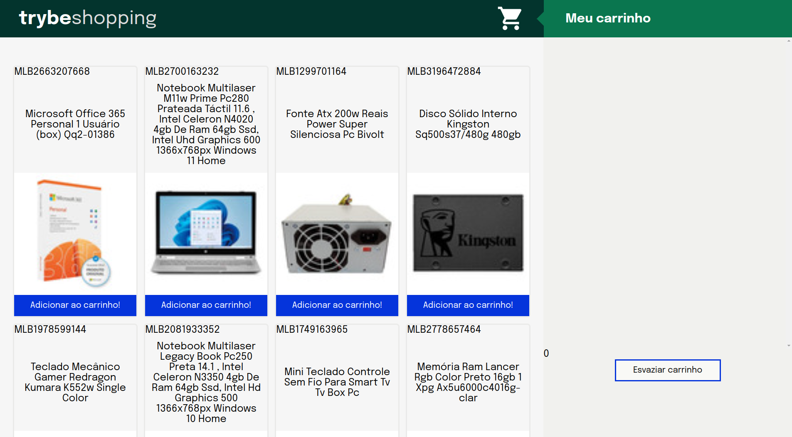

<h1> Shopping Cart </h1>

<h2> About the project </h2>

 

This project was developed in the front-end course, with the proposal to use the tools for introducing the front-end and asynchronous JavaScript.

 

<h2> Skills </h2>

<ul>

<li>Use the React, HTML, CSS to create the pages;</li>
<li>Use the Mercado Livre's API;</li>
<li>Use the Test Driven Development;</li>
<li>Use the JavaScript;</li>

</ul>
  
<h2> Project Evaluation </h2>

<h2>Contact </h2>

 For more information contact us: 

